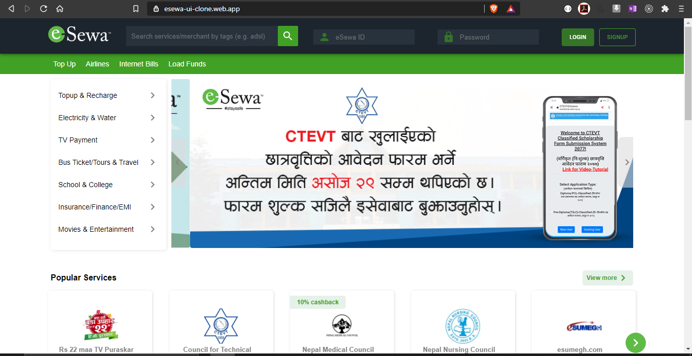
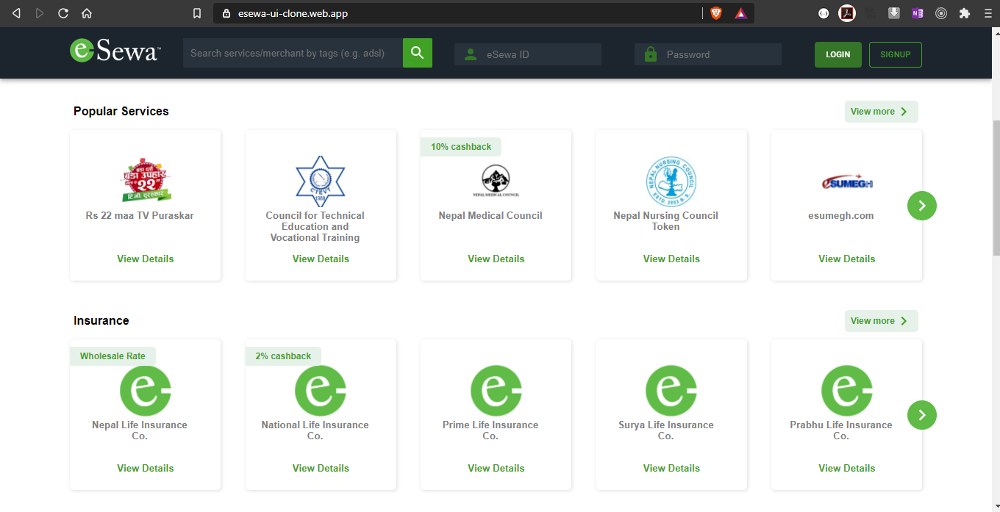
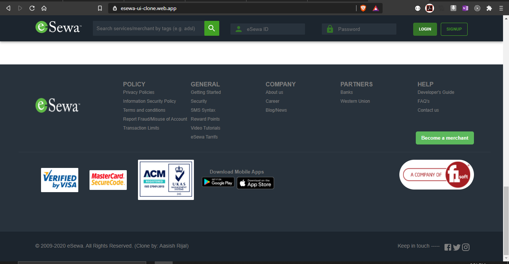

# e-Sewa UI clone

  

**Description** :

Following UI is just clone of Nepal's one of the leading payment gateway **'e-Sewa'** All the design credits and assets related to this project belongs to the owner self.

  ***Dependencies***

 - react-swipeable-views: ^0.13.9
 - @material-ui/core: ^4.11.0
 - @material-ui/icons: ^4.9.1

  

## Demo Link : ` https://esewa-ui-clone.web.app/  ` or <a  href="https://esewa-ui-clone.web.app/">CLICK HERE</a>

 **Tech Stacks***
| React Js | JavaScript | Jsx|  Visual Code Studio|

 

 # App Previews:

- ** .*. **

  

- ** .*. **

- ** .*. **

